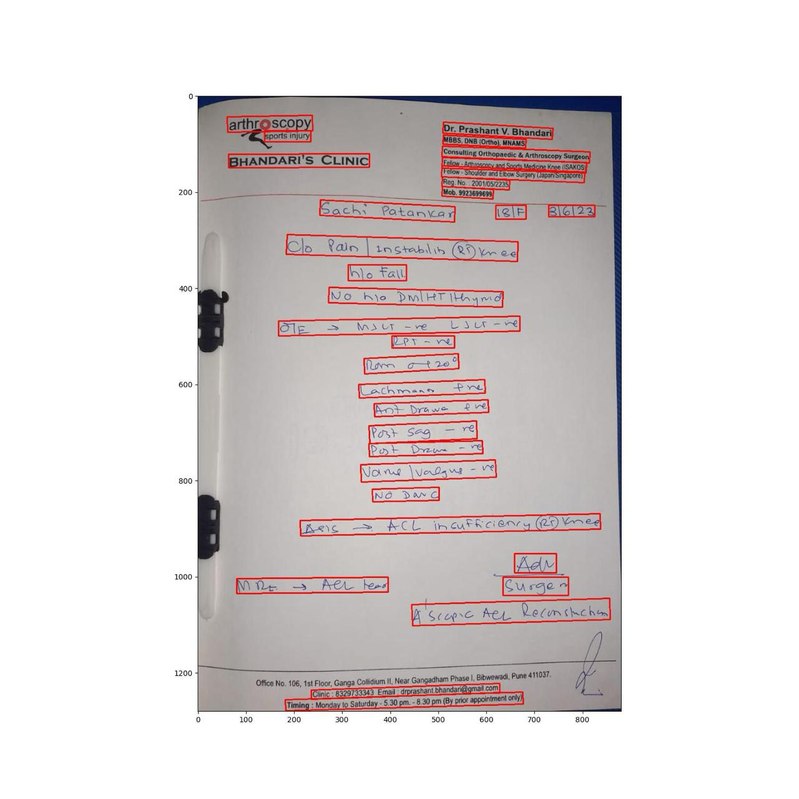

# PillChime - Never Miss a Dose!

This is an easy, quick and one-stop solution to tracking medication dosages. In this repository, we have developed a system that integrates itself with [Google Home](https://home.google.com/welcome/), using the [Google Cloud Console](https://console.cloud.google.com/welcome/new?pli=1) utility.  
Similarly, we also link it with [Amazon Alexa](https://alexa.amazon.com/) using the [Amazon Developer Console](https://developer.amazon.com/).

This projects implements an optimized [LangChain](https://www.langchain.com/) pipeline, which makes use of the latest open-source large language model [Llama3 : 8b](https://ai.meta.com/blog/llama-3-2-connect-2024-vision-edge-mobile-devices/), along with open-source [PaddleOCR](https://github.com/PaddlePaddle/PaddleOCR). 

The user is required to simply upload an image of a medical prescription, and PillChime will automatically set up reminder schedules in your default calendar application.

## Architecture

The following is PillChime's HLD, that describes it's control flow and architecure:


One of the key features of our pipeline is that user data is always protected by a multi-layer protocol.
## PillChime Pipeline

In this section, we will walk through the PillChime Pipeline, and review content at various stages.

**1. Upload Image of the Prescription**

Consider the following medical prescription as an example:


We have re-trained a version of [PaddleOCR](https://github.com/PaddlePaddle/PaddleOCR) by using the method of **Partial-Layered Weights Freezing (PLWF)**, by adding a **temperature parameter** to **weight-decay** during training.


L : Total loss function.

𝑇 : Temperature parameter for normalization.

𝑊𝑖 : Weights for layer (𝑖)

𝜆 : Weight decay factor for non-frozen layers.
𝛼 : Reduced weight decay factor for frozen layers (or partial freezing).

𝐼(𝑓(𝑖)) : Indicator function that equals 1 if layer 𝑖 is frozen and 0 otherwise.

∥𝑊𝑖∥ * ∥𝑊𝑖∥ : Squared ℓ2 to ℓ2 normal decay.


**2. Recongise and Parse Text**

The following are the text boxes generated on that prescription.



The OCR model is able to recognise all the text within this, and presents the following string:

```bash
  "aon py Dr. Prashant V. Bhandari sports injury MBBS, DNB (Ortho), MNAMS Consulting Orthopaedic & Arthroscopy Surgeon Y Fellow - Arthroscopy and Sports Medicine Knee (ISAKOS) BHANDART'S CLINIC Fellow -Shouder and Elbow Surgery (apanSingaore) Reg, No. 20010572235 Mob. 9923699699 Sachs Patan\ar iZl— Sica Clo Rain | incrablin Qyn ce Ilo Fa\l No Kye PwlRT hyn Cle, 5 Www ace 1S Wey ao Rey =e Quen gt 20° WAC nan eae gv Ao> Dawe & Yous sag = Pot Deu - Van \Vadsur - ve NO DWE ER 25) en ee re ACL IWNcuFR CI eNyY YY ie AaAv Cusge ee Aer Recum schon WM 3. KO heer i iail.com Clinic : 8329733343 Email: drprashant bhandari@gm: ¢ No. 106, 1st FI PI Bibwewadi, Pune 411037. it i, a 406, 1st Floor, Ganga Collidium II, Near Gangadham Phase 1, Bi Office No. 106, i imins i tment only) 19 : Monday to Saturday - 5.30 pm. - 8.30 pm (By prior appoint"
```

**3. Obtain JSON prescription from Llama3.2**
 
After this, we route this string to [Llama3:8b](https://ai.meta.com/blog/), with a custom prompt.

Upon parsing this, Llama produces the following JSON strin that contains the prescription.

```json
{{
  "patient": {
    "name": "Sachi Patankar",
    "age": 18,
    "gender": "female",
    "prescribedBy": "Dr. Bhandari"
  },
  "prescription": [
    {
      "medicine": "Hm. CoA Tablet Painkiller",
      "dosage": "1",
      "timing": ["before lunch"]
    }
  ]
}
```

**4. Return JSON prescription to Client-Side API**

Llama runs **on-device** with **GPU Hardware Acceleration**, using the **Ollama CLI** utility. We use [Flask](https://flask.palletsprojects.com/en/2.0.x/deploying/) to create API utility, and service our **React front-end**. We have also used [MongoDB](https://www.mongodb.com/) to store user data in a protected way.

## Authors

[Aarya Bhave](https://www.linkedin.com/in/aarya-bhave-aa4a13256/?originalSubdomain=in)
[Shubham Shinde](https://www.linkedin.com/in/shubhamshinde6762/)
[Advait Joshi](https://www.linkedin.com/in/joshiadvait/)
[Sachi Patankar](https://www.linkedin.com/in/sachi-patankar-33549b245/)
